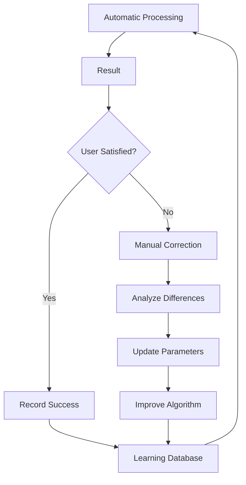

# 🗡️ Katana - Intelligent PDF Processing Agent

## 📋 Program Overview

**Katana** is an advanced AI agent specialized in the automatic processing of scanned PDF documents. The system combines computer vision, machine learning, and a graphical interface to extract, crop, and optimize images from PDF documents with increasing precision over time.

## 🎯 Main Purpose

Katana is designed to:
- **Automate** image extraction from scanned PDFs
- **Intelligently crop** relevant content by removing margins and white spaces
- **Optimize** the quality and size of extracted images
- **Learn** from user feedback to continuously improve performance
- **Handle** large volumes of documents efficiently

## ⚙️ Key Features

### 1. Automatic Extraction
- **PDF Analysis**: Scans every page of the document
- **Image Detection**: Automatically identifies present images
- **Metadata Extraction**: Retrieves DPI, resolution, and technical information
- **Format Conversion**: Transforms into optimized JPGs

### 2. Smart Cropping
- **Contour Detection**: Uses computer vision algorithms to identify content edges
- **Margin Elimination**: Automatically removes white spaces and margins
- **Size Optimization**: Adapts to target format (e.g., A4)
- **Quality Preservation**: Maintains optimal resolution

### 3. Batch Processing
- **Multiple Processing**: Handles multiple PDFs simultaneously
- **Smart Timeout**: Prevents blocking on complex images (max 10s for color analysis)
- **Adaptive Sampling**: Optimizes analysis on ultra-high resolution images (>4000px)
- **Error Handling**: Automatic recovery with fallback strategies

### 4. Quality Assurance
- **Automated Tests**: Dedicated scripts for metadata and autocrop
- **Check Quality**: Unified script (`check_quality.bat`) for quick validation
- **Linting**: Integrated Python syntax verification

### 5. Advanced Graphical Interface
- **Intuitive GUI**: User-friendly interface with Tkinter
- **Drag & Drop**: Simple file loading
- **Image Preview**: Visualization of extracted images
- **Manual Controls**: Possibility of manual cropping for corrections
- **Progress Bar**: Visual feedback during processing

## 🚀 How to Run the Program

### Prerequisites
```bash
# Install dependencies
pip install -r requirements.txt
```

### Start Graphical Interface
```bash
# Start main GUI
python katana_gui.py
```

### Command Line Interface (CLI) Usage
Katana offers a complete CLI. Run `python katana.py` without arguments for help.

```bash
# Example: process PDF in A4 format
python katana.py document.pdf --format A4 --dpi 300

# Example: process entire directory
python katana.py . --no-crop
```

### Verification and Testing
To ensure code quality before changes:

```bash
# Runs all quality checks (lint, unit tests, integration tests)
check_quality.bat
```

## 🧠 Machine Learning System

### Learning Architecture

Katana implements a **supervised learning** system that continuously improves performance through user feedback.

#### 1. Feedback Collection
```python
# Recorded feedback types
- manual_correction: User manual corrections
- auto_success: Approved automatic crops
- parameter_adjustment: Parameter modifications
- quality_rating: Quality ratings
```

#### 2. Learning Metrics
- **Accuracy Rate**: Percentage of correct automatic crops
- **Improvement Trend**: Improvement trend over time
- **Error Patterns**: Analysis of recurring errors
- **User Satisfaction**: User satisfaction level

#### 3. Optimization Algorithms

##### Adaptive Contour Detection
```python
# Self-optimizing parameters
- threshold_values: Detection thresholds
- morphological_operations: Morphological operations
- contour_filtering: Contour filters
- crop_margins: Crop margins
```

##### Machine Learning Pipeline
1. **Feature Extraction**: Extract features from images
2. **Pattern Recognition**: Recognize successful patterns
3. **Parameter Tuning**: Automatic parameter optimization
4. **Validation**: Validation on new documents

#### 4. Intelligent Feedback Loop



#### 5. Persistence and Evolution

##### Learning Files
- **katana_learning.json**: Experience database
- **learning_stats.py**: Statistics and analysis
- **feedback_tool.py**: User feedback management

##### Learning Data Structure
```json
{
  "sessions": [
    {
      "timestamp": "2025-01-XX",
      "pdf_file": "document.pdf",
      "auto_crops": 15,
      "manual_corrections": 2,
      "accuracy": 0.87,
      "improvements": [
        {
          "parameter": "crop_threshold",
          "old_value": 127,
          "new_value": 135,
          "reason": "better_edge_detection"
        }
      ]
    }
  ],
  "global_stats": {
    "total_processed": 1250,
    "accuracy_trend": [0.65, 0.72, 0.81, 0.87],
    "best_parameters": {...}
  }
}
```

### Learning System Benefits

1. **Continuous Improvement**: Every use improves performance
2. **Personalization**: Adapts to the user's document style
3. **Error Reduction**: Progressive decrease in errors
4. **Increasing Efficiency**: Fewer manual interventions over time
5. **Adaptability**: Adapts to new document types

## 📊 Performance Metrics

### Key Indicators
- **Processing Speed**: ~2-5 seconds per page
- **Cropping Accuracy**: 85-95% (improves with use)
- **Size Reduction**: 60-80% compared to original
- **Preserved Quality**: >95% of original quality

### Progress Monitoring
```python
# View statistics
python learning_stats.py

# Example output:
# Total sessions: 45
# Average accuracy: 89.3%
# Last month improvement: +12.5%
# Manual corrections: -34% compared to last month
```

## 🔧 Advanced Configuration

### Optimizable Parameters
```python
# Configuration in katana.py
CONFIG = {
    'crop_threshold': 127,        # Edge detection threshold
    'min_contour_area': 1000,     # Minimum contour area
    'morphology_kernel': (5, 5),  # Morphological operations kernel
    'target_dpi': 300,            # Output target DPI
    'quality_factor': 95          # JPG quality (1-100)
}
```

### Debug Mode
```python
# Activate detailed debug
python debug_color_detection.py  # Debug color detection
python debug_mask_creation.py    # Debug mask creation
```

## 📁 Output Structure

```
output_images/
├── pdf_document/
│   ├── document_page_1_img_1.jpg         # Original image
│   ├── document_page_1_img_1_cropped.jpg # Cropped version
│   ├── document_page_2_img_1.jpg
│   ├── document_page_2_img_1_cropped.jpg
│   └── ...
└── feedback_logs/
    ├── manual_corrections.json
    └── learning_progress.json
```

## 🎓 Conclusions

Katana represents a complete solution for intelligent scanned PDF processing, combining:
- **Advanced automation** to reduce manual work
- **Continuous learning** to improve over time
- **Intuitive interface** for ease of use
- **Flexibility** to adapt to different needs

The system is designed to evolve with usage, becoming increasingly precise and efficient in processing the user's specific documents.

---

*Documentation updated: March 2026*  
*Katana Version: 3.0*  
*Authors: Cohen AI Assistant & Claudio Barracu*

---

*In memory of Minoru Shigematsu*
