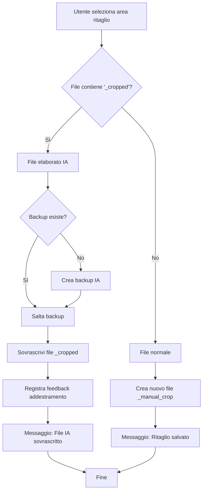

# 🔧 Risoluzione Sovrascrittura Ritaglio Manuale

## 🎯 Problema Risolto

**Situazione precedente**: Quando l'utente effettuava un ritaglio manuale su un file elaborato dall'IA (con suffisso `_cropped`), il sistema creava un nuovo file con suffisso `_manual_crop` invece di sovrascrivere il file IA originale.

**Comportamento desiderato**: Il ritaglio manuale dovrebbe sovrascrivere direttamente il file `_cropped` dell'IA, mantenendo lo stesso nome file.

## 🔍 Analisi del Problema

### Logica Precedente (Problematica)
```python
# Condizione che escludeva i file già corretti manualmente
is_ai_processed = "_cropped" in base_path.stem and not "_manual_crop" in base_path.stem
```

**Problema**: La condizione `and not "_manual_crop" in base_path.stem` impediva la sovrascrittura di file che erano già stati corretti manualmente in precedenza.

### Logica Corretta (Implementata)
```python
# Condizione semplificata che identifica tutti i file IA
is_ai_processed = "_cropped" in base_path.stem
```

**Soluzione**: Rimossa la condizione di esclusione, permettendo la sovrascrittura di TUTTI i file `_cropped`, indipendentemente da correzioni precedenti.

## ⚙️ Modifiche Implementate

### File Modificato
- **katana_gui.py** - Metodo `save_crop()` (linee 645-671)

### Cambiamenti Specifici

#### 1. Semplificazione Condizione di Rilevamento
```python
# PRIMA
is_ai_processed = "_cropped" in base_path.stem and not "_manual_crop" in base_path.stem

# DOPO  
is_ai_processed = "_cropped" in base_path.stem
```

#### 2. Ottimizzazione Gestione Backup
```python
# PRIMA
shutil.copy2(original_path, backup_path)

# DOPO
if not backup_path.exists():
    shutil.copy2(original_path, backup_path)
    self.log(f"Backup IA creato: {backup_path.name}", "INFO")
```

**Vantaggio**: Evita la creazione di backup multipli se l'utente corregge lo stesso file più volte.

#### 3. Miglioramento Messaggi di Log
```python
# PRIMA
self.log(f"File IA sostituito con ritaglio manuale: {base_path.name}", "SUCCESS")
self.log(f"Backup IA salvato come: {backup_path.name}", "INFO")

# DOPO
self.log(f"File IA sovrascritto con ritaglio manuale: {base_path.name}", "SUCCESS")
# Log backup solo quando effettivamente creato
```

## 🧪 Verifica Funzionamento

### Test Automatizzato
Creato `test_manual_crop_override.py` che verifica:

#### Test 1: File IA (`_cropped`)
- ✅ **Input**: `test_page_1_img_1_cropped.jpg` (100x100, rosso)
- ✅ **Azione**: Ritaglio manuale (50x50, blu)
- ✅ **Risultato**: File originale SOVRASCRITTO (50x50, blu)
- ✅ **Backup**: Creato `test_page_1_img_1_cropped_ai_backup.jpg` (100x100, rosso)
- ✅ **Nessun file `_manual_crop` generato**

#### Test 2: File Normale (non IA)
- ✅ **Input**: `test_page_1_img_1.jpg` (100x100, verde)
- ✅ **Azione**: Ritaglio manuale (50x50, giallo)
- ✅ **Risultato**: File originale NON modificato
- ✅ **Nuovo file**: Creato `test_page_1_img_1_manual_crop.jpg`

### Risultati Test
```
🎉 TUTTI I TEST SUPERATI!
   La logica di salvataggio funziona correttamente:
   - File _cropped → SOVRASCRITTURA
   - File normali → NUOVO FILE _manual_crop
```

## 📋 Comportamento Finale

### Scenario 1: Correzione File IA
1. **File originale**: `documento_page_1_img_1_cropped.jpg` (elaborato dall'IA)
2. **Azione utente**: Ritaglio manuale nell'interfaccia
3. **Risultato**:
   - ✅ `documento_page_1_img_1_cropped.jpg` → **SOVRASCRITTO** con ritaglio manuale
   - ✅ `documento_page_1_img_1_cropped_ai_backup.jpg` → Backup automatico (solo al primo salvataggio)
   - ✅ Feedback registrato per addestramento IA
   - ✅ Messaggio: "File IA sovrascritto: documento_page_1_img_1_cropped.jpg"

### Scenario 2: Ritaglio File Normale
1. **File originale**: `documento_page_1_img_1.jpg` (non elaborato dall'IA)
2. **Azione utente**: Ritaglio manuale
3. **Risultato**:
   - ✅ File originale rimane invariato
   - ✅ `documento_page_1_img_1_manual_crop.jpg` → Nuovo file creato
   - ✅ Messaggio: "Ritaglio manuale salvato: documento_page_1_img_1_manual_crop.jpg"

## 🎯 Vantaggi della Soluzione

### 1. **Workflow Intuitivo**
- L'utente vede direttamente il risultato della sua correzione
- Non ci sono file duplicati confusi
- Il nome file rimane coerente

### 2. **Gestione Intelligente Backup**
- Backup automatico della versione IA originale
- Evita backup multipli per correzioni successive
- Preserva la cronologia per analisi

### 3. **Apprendimento Ottimizzato**
- Ogni correzione manuale viene registrata per l'addestramento
- L'IA impara dai feedback dell'utente
- Miglioramento continuo della precisione

### 4. **Sicurezza Dati**
- Backup automatico previene perdita dati
- Possibilità di ripristino versione IA se necessario
- Log dettagliato di tutte le operazioni

## 🔄 Flusso Operativo Completo



## 📊 Impatto sulla User Experience

### Prima della Modifica
- ❌ File duplicati confusi (`_cropped` + `_manual_crop`)
- ❌ Workflow non intuitivo
- ❌ Difficoltà nell'identificare la versione corretta

### Dopo la Modifica
- ✅ **Sovrascrittura diretta** del file IA
- ✅ **Workflow naturale** e intuitivo
- ✅ **File unico** con il risultato finale
- ✅ **Backup automatico** per sicurezza
- ✅ **Apprendimento IA** ottimizzato

---

**Stato**: ✅ **RISOLTO**  
**Data**: Gennaio 2025  
**Test**: ✅ **SUPERATI**  
**Implementazione**: ✅ **ATTIVA**

---

*In memory of Minoru Shigematsu*
